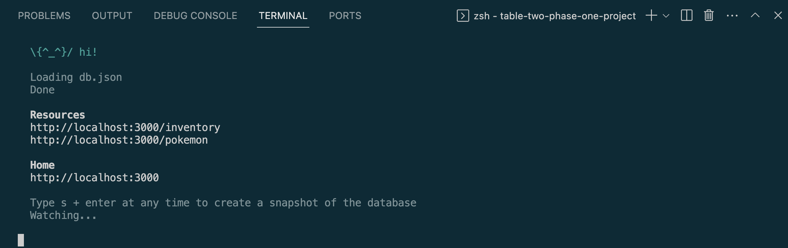
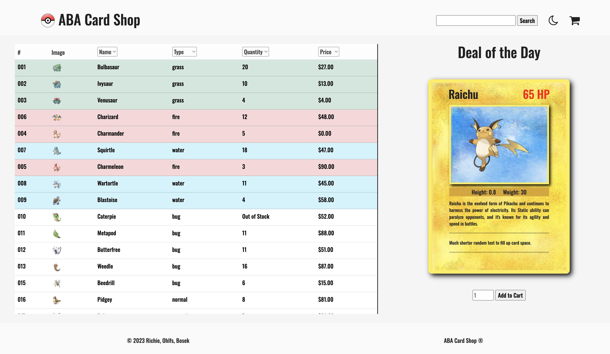
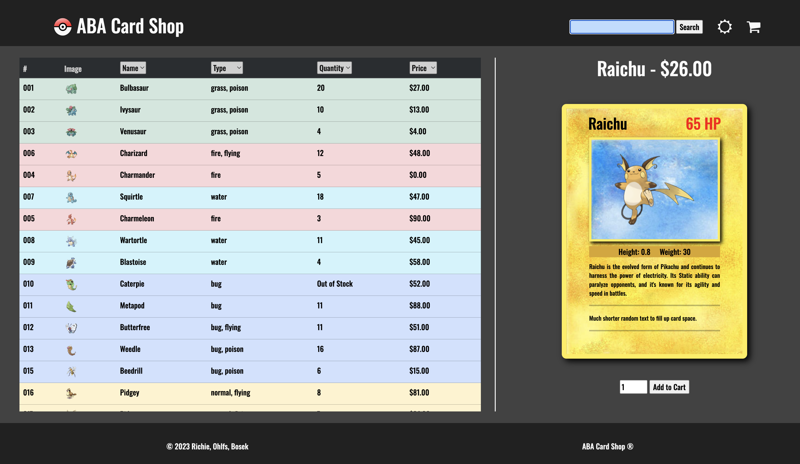

# Table 2 Phase 1 Project

## Home

* [Dependencies](#dependencies)
* [Starting the Application](#starting-the-application)
* [License](#license)
* [Attributions](#attributions)

## Intro To Project

- This project was made to complete the assignment `Phase 1 Project` for the `SE-West-091123` class for the [Flatiron](https://flatironschool.com/) Software Engineering Boot Camp.
- The project was completed using the following: `HTML`, `CSS`, `JavaScript`.

## Dependencies

- The following is needed to run this application: `Node`, `JSON Server`.

- You must have access to these dependencies in the directory that you are running this application in. If your environment does not have these requirements, you may install them in this order by going to these websites and following the installation instructions:

- Node: `https://www.npmjs.com/package/node`

- JSON Server: `https://www.npmjs.com/package/json-server`

## Starting the Application

- Make sure nothing is currently running on `http://localhost:3000`.
- Open a terminal window in the main directory of where this project is located on your computer.
- Run `json-server --watch db.json`.
- It should be running on `http://localhost:3000` and your terminal should look something like this:
- ==============================================
    
- ==============================================
- Open another terminal window in the main directory of where this project is located on your computer
- Run `open index.html`.
- It should take you to a page that looks like this:
- ==============================================
    
- ==============================================

## Using the Application

- The user can scroll through the list of cards the app sells. The user can display a card in the card section located on the right side of the page by clicking on the card desired.
- The user can also display a card by typing a card name in the search bar located in the top right area of the page. There is also functionality to bring up possible options for the user to choose from as the user types in names. The options are located in a dropdown right under the search bar that appears when the user starts typing.
- When the card is displayed, the user will be shown more detailed information about the card and be given the option to add the card to the user's cart, if the card is in stock. If the user adds a card to the cart, the quantity of that card will be updated on the page.
- The user can access their cart by clicking the cart icon located in the top right of the page. When the user does so, a modal pops up on the page that displays some information about the user and keeps a running total of the items the user clicked on.
- At the bottom of the modal is a submit button that will create a document of the order and store it in the database. When the user completes an order, the inventory in the database will be updated.

## Optional Features

- The user can adjust the order in which the cards are listed by selecting the different options located at the top of every column. For example, the user can click on the 'Name' option and sort the list alphabetically or the reverse.
- The user can switch the color theme of the app by clicking the moon located in the top right area of the page, to the right of the search bar.
- It should look like this:
- ==============================================
    
- ==============================================

## License

- This project is is made in conjunction with the standard `MIT` license provided by `GitHub` upon creation of a new repository. A copy of the license is included with this project in a file named: `LICENSE`.

## Attributions

- The project was completed with collaboration from: `Anthony Bosek`, `Austin Ohlfs`, and `Brian Richie Sr.`
- This project was created with combination of skills learned from the `Flatiron` curriculum and our own individual research.
- The data used to seed the original data prior to being modified for the purposes of this project was supplied by [Pokedex](https://rapidapi.com/lduran2-CvRRB1hLBCj/api/pokedex2) created by `Luis Duran`.

## What I Learned

- `Anthony`: 
- `Austin`: 
- `Brian`: I learned a bit about the complexities of the `GitHub` repositories and a bit about the power of the `GitHub` interface. Pushing and pulling into the repository while code is being altered will inevitably lead to conflicts. However, with good communication and knowledge gained, we were able to overcome the conflicts efficiently and continue to complete this project. And as always, I learned a great deal from the people I worked with on this project. The intelligence and creativity of my teammates is amazing. Thank you Anthony, Austin, and the `Flatiron` community.

* [Back To Top](#table-2-phase-1-project)