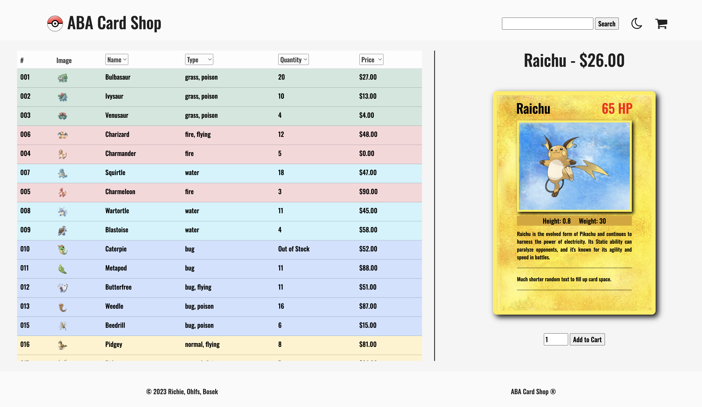

# Table 2 Phase 1 Project

## Home

* [Dependencies](#dependencies)
* [Starting the Application](#starting-the-application)
* [License](#license)
* [Attributions](#attributions)

## Intro To Project - Ex. of h2 in preview

- This project was made to complete the assignment `Phase 1 Project` for the `SE-West-091123` class.
- The project was completed using the following: `HTML`, `CSS`, `JavaScript`.

## Dependencies

- *** Note *** (Collaborate with team to decide which route to take)

- Open a terminal in the main directory of this project.

- Option 1

- *** Note *** (Create a package.json)

- Run `npm i`.

- ==============================================

- Option 2

- The following is needed to run this application: `Node`, `JSON Server`.

- You must have access to these dependencies in the directory that you are running this application in. If your environment does not have these requirements, you may install them by going to these websites and following the installation instructions:

- Node: `https://www.npmjs.com/package/node`

- JSON Server: `https://www.npmjs.com/package/json-server`

## Starting the Application
- Make sure nothing is currently running on `port 3000`.
- Run `json-server --watch db.json`.
- It should be running on `port 3000` and it should look like this:
- ==============================================
    
- ==============================================
- Run `open index.html`.
- It should take you to a page that looks like this:
- ==============================================
    
- ==============================================

### Client - Ex. of h3 in preview

## License

- This project is is made in conjunction with the standard `MIT` license provided by `GitHub` upon creation of a new repository. A copy of the license is included with this project in a file named: `LICENSE.md`.

## Attributions

- The project was completed with collaboration from: `Anthony`, `Austin`, and `Brian`.

* [Back To Top](#table-2-phase-1-project)